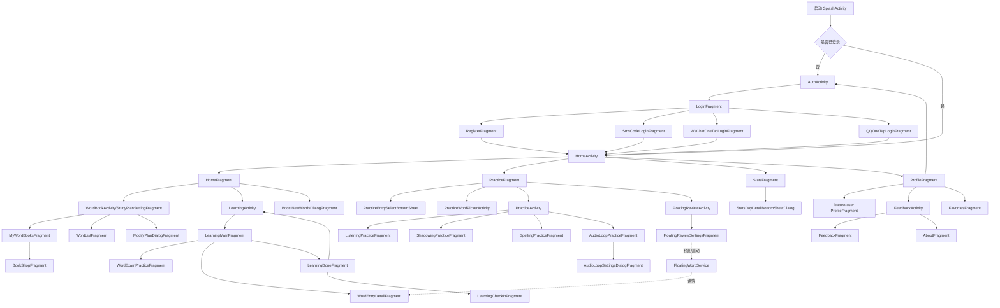
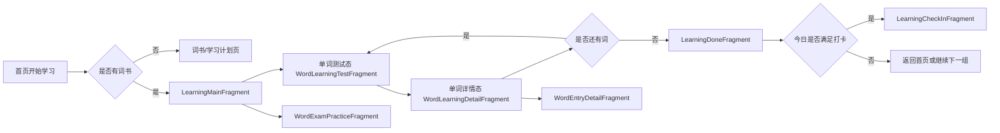
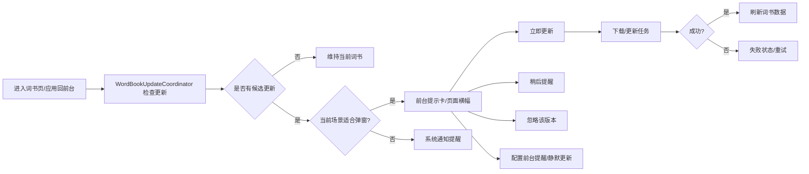

# 记单词项目功能梳理

> 分析基于当前仓库代码结构、导航图、页面布局、ViewModel、Domain Facade 与启动任务整理。  
> 由于存在部分中文源码编码异常、部分页面为占位实现，以下内容以“代码实际行为”为准，而不是以 UI 文案为唯一依据。

## 待补充信息

基于当前仓库，我已经可以输出一版较完整分析，但如果你后续要把它用于正式需求说明，建议补充以下资料：

| 待补充项 | 当前情况 | 影响 |
|---|---|---|
| `app/功能清单` 文件 | 当前工作区中未找到该文件实体 | 无法与产品原始清单逐项做差异比对 |
| PRD / 原型图 / 交互稿 | 仓库内未见 | 部分页面只能按代码反推，不确定是否还有未提交的产品设定 |
| 后端接口文档 | 仓库未提供成体系 API 文档 | 某些失败原因、边界规则只能从前端异常处理推断 |
| 词书更新业务规则说明 | 只有验收清单 `WORD_BOOK_UPDATE_ACCEPTANCE.md` | 可以确认流程，但无法确认完整运营策略 |
| 会员/VIP、扫码、关于页更新检查等业务说明 | 代码里有 UI 痕迹或占位 | 难以判断是待开发功能还是已废弃设计 |

## 项目功能总览

这是一个以“词书驱动的英语学习 App”为核心的 Android 多模块项目，已经实现的能力不只是背单词，还包括练习、打卡统计、收藏、词书商城、账号体系、反馈系统、悬浮复习和词书更新。

| 一级能力 | 核心内容 | 当前实现状态 |
|---|---|---|
| 启动与全局任务 | 启动路由、会话踢下线监听、前台词书更新检测、首屏后自动拉起悬浮复习 | 已实现 |
| 登录注册 | 密码登录、注册、短信验证码登录、微信登录、QQ 登录 | 已实现 |
| 首页工作台 | 今日学习概览、同步横幅、开始学习、加量新学、进入词书 | 已实现 |
| 词书管理 | 当前词书、切换词书、词书进度、词表查看、收藏、词书商城下载 | 已实现 |
| 学习计划 | 每日新词/复习数量、测试模式、单词顺序、重置进度 | 已实现 |
| 学习主流程 | 单词测验、详情页、收藏、标记掌握、单词分享、单词真题练习、完成页、打卡页 | 已实现 |
| 自由练习 | 听力、跟读、拼写、音频循环、真题练习入口、选词练习 | 已实现 |
| 统计与打卡 | 学习总量、月历、周柱状图、日详情、补签 | 已实现 |
| 个人中心 | 学习数据、收藏入口、反馈入口、关于入口、退出登录 | 已实现 |
| 账号资料管理 | 昵称、性别、头像、密码、社交绑定、删号、手机号绑定 | 部分实现，部分占位 |
| 反馈与关于 | 文本反馈、图片反馈、关于页、版本展示、检查更新占位 | 已实现/部分占位 |
| 悬浮复习 | 悬浮球、浮卡、词条字段配置、顺序配置、自选词、透明度预览、自动启动 | 已实现 |
| 词书更新 | 前台弹窗提醒、本地通知提醒、立即更新、稍后提醒、忽略版本、静默更新开关 | 已实现 |

## 模块拆分

| 模块 / 业务域 | 代码模块 | 主要页面 / 组件 | 说明 |
|---|---|---|---|
| 启动与宿主 | `app` | `SplashActivity`、启动任务、`WXEntryActivity` | 负责启动分流、应用级后台任务、微信回调 |
| 首页壳层 | `feature-home` | `HomeActivity` + 4 个 Tab | 负责主导航、首页工作台、练习入口、统计、个人中心 |
| 词书与计划 | `feature-wordbook` | `WordBookActivity`、学习计划、我的词书、商城、词表、收藏 | 词书相关的主要业务中心 |
| 学习与练习 | `feature-learning` | `LearningActivity`、`PracticeActivity`、单词详情、完成页、打卡页、各类练习页 | 核心学习执行态 |
| 用户与账号 | `feature-user` | `AuthActivity`、登录注册、资料页、密码、删号、头像预览等 | 登录与账号资料管理 |
| 反馈 | `feature-feedback` | `FeedbackActivity`、反馈页、关于页 | 用户反馈、应用信息 |
| 悬浮复习 | `feature-floating-review` | 设置页、悬浮服务、悬浮球、浮卡 | 跨应用/全局复习入口 |
| 领域服务 | `domain` | `StartupOrchestrator`、`PracticeFacade`、`FloatingReviewFacade`、`WordBookUpdateCoordinator` 等 | 业务规则门面 |
| 数据层 | `data` | Room/MMKV/WorkManager/同步/下载/更新 Worker | 持久化、同步、下载、后台任务 |
| 网络与语音 | `network`、`speech`、`speech-api` | API、TTS、跟读评分 | 远程接口、语音合成、语音评测 |

## 页面清单

### 1. App 启动与宿主页

| 页面 / 组件 | 类型 | 所属模块 | 入口 | 主要出口 |
|---|---|---|---|---|
| `SplashActivity` | Activity | `app` | App 冷启动 / 桌面图标 | 跳 `HomeActivity` 或 `AuthActivity` |
| `HomeActivity` | Activity | `feature-home` | 启动分流后进入首页 | 打开词书、登录、反馈、学习、练习、悬浮设置 |
| `WXEntryActivity` | Activity | `app` | 微信 SDK 回调 | 返回登录/绑定流程 |

### 2. 首页 Tab 页

| 页面 / 组件 | 类型 | 所属模块 | 入口 | 主要出口 |
|---|---|---|---|---|
| `HomeFragment` | Fragment | `feature-home` | `HomeActivity` 底部 Tab-首页 | 学习、词书、加量新学弹窗 |
| `BoostNewWordsDialogFragment` | Dialog | `feature-home` | 首页“新学已完成后继续学习” | 返回首页并发起新学习 |
| `PracticeFragment` | Fragment | `feature-home` | `HomeActivity` 底部 Tab-练习 | 练习模式选择弹窗、选词页、练习页、悬浮设置 |
| `PracticeEntrySelectBottomSheet` | BottomSheet | `feature-home` | 练习模式点击后弹出 | 自选词 / 随机词进入 `PracticeActivity` |
| `PracticeRecordDetailBottomSheetDialog` | BottomSheet | `feature-home` | 点击练习记录 | 查看单次练习详情 |
| `StatsFragment` | Fragment | `feature-home` | `HomeActivity` 底部 Tab-统计 | 日详情弹窗 |
| `StatsDayDetailBottomSheetDialog` | BottomSheet | `feature-home` | 点击日历某一天 | 补签 / 关闭 |
| `ProfileFragment` | Fragment | `feature-home` | `HomeActivity` 底部 Tab-我的 | 收藏、反馈、关于、账号资料、退出登录 |

### 3. 词书域页面

| 页面 / 组件 | 类型 | 所属模块 | 入口 | 主要出口 |
|---|---|---|---|---|
| `WordBookActivity` | Activity | `feature-wordbook` | 首页、首页个人页、词书更新通知、深链 | 内部导航到计划/我的词书/商城/收藏 |
| `StudyPlanSettingFragment` | Fragment | `feature-wordbook` | `WordBookActivity` 默认起始页 | 词表、我的词书、修改计划 |
| `ModifyPlanDialogFragment` | BottomSheet | `feature-wordbook` | 学习计划页编辑计划按钮 | 保存后返回学习计划页 |
| `MyWordBooksFragment` | Fragment | `feature-wordbook` | 从学习计划页切换词书，或深链 `myapp://wordbook/my-books` | 切换当前词书、进入商城 |
| `BookShopFragment` | Fragment | `feature-wordbook` | 我的词书页、深链 `myapp://wordbook/shop` | 下载、更新、取消下载 |
| `WordListFragment` | Fragment | `feature-wordbook` | 学习计划页查看词表 | 返回学习计划页 |
| `FavoritesFragment` | Fragment | `feature-wordbook` | 首页个人页收藏，深链 `myapp://favorites` | 返回上级 |

### 4. 学习与练习页面

| 页面 / 组件 | 类型 | 所属模块 | 入口 | 主要出口 |
|---|---|---|---|---|
| `LearningActivity` | Activity | `feature-learning` | 首页开始学习、学习完成页继续学习、悬浮词卡查看详情 | 学习主流程、单词详情 |
| `LearningMainFragment` | Fragment | `feature-learning` | `LearningActivity` 默认页 | 完成页、真题页 |
| `WordLearningTestFragment` | 子 Fragment | `feature-learning` | 学习主流程内部 | 切换到详情态 |
| `WordLearningDetailFragment` | 子 Fragment | `feature-learning` | 学习主流程内部 | 下一个题、全量词条详情 |
| `WordShareBottomSheetDialog` | BottomSheet | `feature-learning` | 学习页分享按钮 | 复制分享文本 |
| `WordEntryDetailFragment` | Fragment | `feature-learning` | 学习页详情跳转、悬浮词卡详情、完成页词项点击 | 返回学习流或关闭 Activity |
| `WordExamPracticeFragment` | Fragment | `feature-learning` | 学习页“真题” | 返回学习流 |
| `LearningDoneFragment` | Fragment | `feature-learning` | 学习结束 | 继续学习 / 打卡页 / 返回主页 |
| `LearningCheckInFragment` | Fragment | `feature-learning` | 学习完成页自动触发或手动跳转 | 分享打卡、返回主页 |
| `PracticeActivity` | Activity | `feature-learning` | 首页练习页 | 各练习 Fragment |
| `ListeningPracticeFragment` | Fragment | `feature-learning` | `PracticeActivity` 听力模式 | 完成/退出 |
| `ShadowingPracticeFragment` | Fragment | `feature-learning` | `PracticeActivity` 跟读模式 | 完成/退出 |
| `SpellingPracticeFragment` | Fragment | `feature-learning` | `PracticeActivity` 拼写模式 | 完成/退出 |
| `AudioLoopPracticeFragment` | Fragment | `feature-learning` | `PracticeActivity` 音频循环模式 | 设置弹窗、后台 Service |
| `AudioLoopSettingsDialogFragment` | BottomSheet | `feature-learning` | 音频循环页设置按钮 | 保存设置 |
| `PracticeWordPickerActivity` | Activity | `feature-learning` | 练习模式选择“自选词”、悬浮复习设置“自选词” | 选词结果回传 |

### 5. 用户与反馈页面

| 页面 / 组件 | 类型 | 所属模块 | 入口 | 主要出口 |
|---|---|---|---|---|
| `AuthActivity` | Activity | `feature-user` | 启动未登录、会话失效、退出登录 | 登录完成后结束并回首页 |
| `LoginFragment` | Fragment | `feature-user` | `AuthActivity` 默认页 | 注册、微信登录、QQ 登录、短信登录 |
| `RegisterFragment` | Fragment | `feature-user` | 登录页 | 注册成功后退出认证栈 |
| `WeChatOneTapLoginFragment` | Fragment | `feature-user` | 登录页微信入口 | 授权成功后完成登录 |
| `QQOneTapLoginFragment` | Fragment | `feature-user` | 登录页 QQ 入口 | 授权成功后完成登录 |
| `SmsCodeLoginFragment` | Fragment | `feature-user` | 登录页验证码入口 | 验证码登录成功后退出认证栈 |
| `feature-user ProfileFragment` | Fragment | `feature-user` | 首页我的页点击编辑按钮，深链 `myapp://user/profile` | 改昵称/性别/头像/密码/绑定/删号等 |
| `ChangeGenderBottomDialog` | BottomSheet | `feature-user` | 资料页修改性别 | 确认后回资料页 |
| `AvatarActionBottomSheetDialog` | BottomSheet | `feature-user` | 资料页点击头像 | 查看大图 / 相册选图 / 拍照 |
| `AvatarPreviewFragment` | Fragment | `feature-user` | 资料页头像查看 | 返回资料页 |
| `ChangePasswordFragment` | Fragment | `feature-user` | 资料页 | 改密成功后回登录页 |
| `BindPhoneFragment` | Fragment | `feature-user` | 资料页 | 当前为占位 |
| `DeleteAccountConfirmFragment` | Fragment | `feature-user` | 资料页 | 删除后清空任务栈回认证页 |
| `FeedbackActivity` | Activity | `feature-feedback` | 首页我的页“反馈/关于” | 反馈页 / 关于页 |
| `FeedbackFragment` | Fragment | `feature-feedback` | 深链 `myapp://feedback` | 发送反馈 |
| `AboutFragment` | Fragment | `feature-feedback` | 深链 `myapp://about` | 检查更新（占位） |
| `FloatingReviewActivity` | Activity | `feature-floating-review` | 首页练习页悬浮设置 | 悬浮复习设置页 |
| `FloatingReviewSettingsFragment` | Fragment | `feature-floating-review` | `FloatingReviewActivity` | 选词、改配置、预览卡片 |

### 6. 非页面但重要的系统组件

| 组件 | 类型 | 作用 |
|---|---|---|
| `FloatingWordService` | Foreground Service | 展示悬浮球与词卡，支持刷新、查看详情、拖拽吸边 |
| `AudioLoopService` | Foreground Service | 后台循环播放单词、拼读、释义，并记录练习时长 |
| `WordBookUpdateNotifier` | 通知组件 | 词书更新不适合弹窗时改为系统通知提醒 |
| `CurrentWordBookUpdateWorker` / 下载 Worker | WorkManager | 执行词书更新与下载后台任务 |

## 页面关系图

### 1. 全局页面关系图

### 2. 学习主链路

### 3. 词书与更新链路

## 功能与页面映射表

| 模块 / 功能点 | 作用 | 对应页面 / 弹窗 / 状态页 | 主要入口 | 主要出口 / 跳转 |
|---|---|---|---|---|
| 启动分流 | 判断登录态并快速进首页或登录页 | `SplashActivity` | App 冷启动 | `HomeActivity` / `AuthActivity` |
| 会话保活与踢下线 | 监听会话失效、自动拉起认证页 | 启动任务、全局观察器 | App 启动后 | 清栈进入 `AuthActivity` |
| 首页学习概览 | 展示当前词书、学习天数、今日任务、同步提示 | `HomeFragment` | 首页 Tab | 开始学习、去词书、加量学习 |
| 新词加量 | 在当日新学完成后额外增加 5/10/20 个新词 | `BoostNewWordsDialogFragment` | 首页开始学习链路中 | 追加学习任务后继续学习 |
| 练习模式入口 | 选择听力/跟读/拼写/音频循环并决定随机或自选词 | `PracticeFragment`、`PracticeEntrySelectBottomSheet` | 练习 Tab | `PracticeActivity` / `PracticeWordPickerActivity` |
| 练习记录查看 | 查看单次练习摘要和单词列表 | `PracticeRecordDetailBottomSheetDialog` | 练习 Tab 记录列表 | 关闭返回练习页 |
| 学习统计 | 展示学习总量、月历、周统计柱状图 | `StatsFragment` | 统计 Tab | 日详情弹窗 |
| 日详情与补签 | 查看某天学习时长、词数，必要时发起补签 | `StatsDayDetailBottomSheetDialog` | 统计月历某日期 | 补签成功或关闭 |
| 首页我的 | 展示用户信息和常用功能入口 | `feature-home ProfileFragment` | 我的 Tab | 收藏、反馈、关于、资料、退出登录 |
| 学习计划配置 | 展示当前词书和每日计划，支持改计划/重置/查看词表 | `StudyPlanSettingFragment`、`ModifyPlanDialogFragment` | 首页/缺词书时强制进入 | 词表、我的词书、保存计划 |
| 我的词书 | 查看已拥有词书，筛选学习中/已完成，切换当前词书 | `MyWordBooksFragment` | 学习计划页、深链 | 设为当前词书、去书城 |
| 词书商店 | 搜索、分类浏览、下载/更新/取消词书 | `BookShopFragment` | 我的词书页 | 下载完成后返回列表态 |
| 词表查看 | 分组查看词条，支持掌握状态筛选 | `WordListFragment` | 学习计划页 | 返回学习计划页 |
| 收藏列表 | 查看已收藏单词 | `FavoritesFragment` | 我的 Tab、深链 | 返回上级 |
| 学习主流程 | 单词测试、详情、收藏、掌握、分享、真题练习 | `LearningMainFragment` 及子页 | 首页开始学习、继续学习 | 完成页、详情页、真题页 |
| 学习完成页 | 展示本轮完成情况并支持继续下一轮 | `LearningDoneFragment` | 学习结束 | 继续学习 / 打卡 / 返回首页 |
| 学习打卡页 | 展示连续打卡、累计时长词数，可分享 | `LearningCheckInFragment` | 学习完成后自动或手动 | 分享或返回首页 |
| 听力练习 | 听音选义 | `ListeningPracticeFragment` | `PracticeActivity` | 完成并保存记录 |
| 跟读练习 | 录音、回放、评分 | `ShadowingPracticeFragment` | `PracticeActivity` | 完成并保存记录 |
| 拼写练习 | 字母池拼词、提示、两次机会 | `SpellingPracticeFragment` | `PracticeActivity` | 完成并保存记录 |
| 音频循环 | 后台循环播放单词、拼写、释义 | `AudioLoopPracticeFragment`、`AudioLoopSettingsDialogFragment`、`AudioLoopService` | `PracticeActivity` | 启停服务、进入后台播放 |
| 自选词练习 | 按搜索结果手工挑选练习词 | `PracticeWordPickerActivity` | 练习模式/悬浮复习设置 | 返回选中词 ID |
| 登录注册 | 密码、验证码、微信、QQ 登录和注册 | `AuthActivity` 下各认证页 | 启动未登录 / 退出登录 | 登录后回首页 |
| 个人资料编辑 | 昵称、性别、头像、密码、绑定、删号 | `feature-user ProfileFragment` 及相关弹窗 | 我的页编辑按钮、深链 | 保存资料 / 强制重新登录 |
| 反馈提交 | 文本 + 联系方式 + 最多 3 张图片 | `FeedbackFragment` | 我的页、深链 | 发送成功/失败提示 |
| 关于页面 | 展示版本和使命文案 | `AboutFragment` | 我的页、深链 | 检查更新占位提示 |
| 悬浮复习设置 | 配置悬浮词卡来源、顺序、字段、透明度、自启 | `FloatingReviewSettingsFragment` | 练习页悬浮入口 | 预览卡片 / 启停悬浮服务 |
| 悬浮词卡服务 | 全局显示悬浮球和词卡，支持刷新和详情跳转 | `FloatingWordService` | 手动启用、开机后自动拉起 | 详情页 / 关闭服务 |
| 词书更新 | 统一处理更新提示、稍后提醒、忽略版本、静默更新 | 我的词书页横幅、前台提示、系统通知 | 应用回前台 / 进入词书页 | 下载更新、延后、忽略 |

## 详细逻辑说明

### 一、启动与全局任务

| 功能点 | 说明 |
|---|---|
| 作用 | 完成启动分流、登录态判断、会话踢下线监听、前台词书更新检查、悬浮复习自动拉起。 |
| 对应页面 / 状态 | `SplashActivity`、`AuthActivity`、`HomeActivity`、前台更新提示、系统通知。 |
| 页面入口和出口 | 冷启动进入 `SplashActivity`；若已登录跳 `HomeActivity`，未登录跳 `AuthActivity`；会话失效可从任意页面清栈跳认证页。 |
| 页面之间跳转 | `StartupOrchestrator.resolveLaunchDestinationFast()` 决定 HOME / AUTH；`SessionKickoutStartupTask` 监听强退；`PostLaunchStartupTask` 在首个非启动页恢复后执行延迟任务。 |
| 核心业务逻辑 | 启动先快判登录态；登录用户后续再异步补做 session warmup；应用回前台时调用 `WordBookUpdateCoordinator.onAppForeground()` 决定是否弹提示或发通知；满足悬浮权限和设置时自动启动悬浮复习。 |
| 前置条件 | 本地已有登录态、悬浮权限、前台活动可安全弹窗。 |
| 限制条件 | 如果当前 Activity 不适合弹窗，则词书更新提醒降级为系统通知；未授权悬浮窗则不会自动启动悬浮复习。 |
| 异常分支 | 登录态过期进入认证页；词书更新检查失败则保持静默或仅显示失败状态；自动启动悬浮失败时不阻塞首页。 |
| 关键交互 | 启动页无强交互；前台更新提示涉及立即更新、稍后提醒、忽略版本、设置开关。 |

### 二、首页工作台与主导航

#### 1. `HomeActivity`

| 维度 | 说明 |
|---|---|
| 作用 | 作为主容器承载首页、练习、统计、我的四个 Tab。 |
| 页面入口 | 启动分流成功后进入。 |
| 页面出口 | 可进入词书域、学习域、练习域、资料页、反馈页；双击返回退出应用。 |
| 跳转逻辑 | 底部导航切换 Fragment；自动登录态检查失败时跳 `AuthActivity`；没有当前词书时跳 `WordBookActivity`。 |
| 核心业务逻辑 | 页面恢复时再次确认用户和词书状态，防止进入空壳首页。 |
| 限制与异常 | 没词书时会被强制引导到词书页；返回键第一次仅提示，2 秒内再次按才退出。 |

#### 2. 首页 Tab `HomeFragment`

| 维度 | 说明 |
|---|---|
| 作用 | 展示今天学习概况，并作为“开始学习”的主入口。 |
| 对应页面 / 状态 | 首页主卡片、同步横幅、学习计划卡、开始学习按钮、加量弹窗。 |
| 入口 | `HomeActivity` 默认 Tab。 |
| 出口 | 进入 `LearningActivity`、`WordBookActivity`、`BoostNewWordsDialogFragment`。 |
| 核心业务逻辑 | 读取当前用户、当前词书、计划、学习天数、今日新学/复习量；根据是否还有待学内容决定按钮文案和动作。 |
| 前置条件 | 已登录；最好已经选定当前词书。 |
| 限制条件 | 没有词书或没有可学单词时，会提示并引导到词书或显示 Toast。 |
| 异常分支 | 数据为空时显示默认/空态；同步 Banner 根据状态决定是否展示。 |
| 关键交互 | 开始学习按钮；当前词书区域点击进入词书；同步提示横幅点击处理；新学完成时弹“再加 5/10/20 个”对话框。 |

#### 3. 练习 Tab `PracticeFragment`

| 维度 | 说明 |
|---|---|
| 作用 | 提供自由练习入口、悬浮复习入口、练习记录回看。 |
| 对应页面 / 状态 | 练习首页、模式选择 BottomSheet、记录详情 BottomSheet、悬浮复习卡片开关。 |
| 入口 | `HomeActivity` 底部 Tab。 |
| 出口 | `PracticeActivity`、`PracticeWordPickerActivity`、`FloatingReviewActivity`。 |
| 核心业务逻辑 | 先通过 `PracticeFacade.getPracticeAvailability()` 判断是否有词书、有单词；模式点击后再决定随机词或自选词；列表区展示最近练习记录。 |
| 前置条件 | 已选词书；练习库中有可练单词。 |
| 限制条件 | `AUDIO_LOOP` 不走常规问答会话，而是服务式播放；悬浮复习依赖悬浮窗权限。 |
| 异常分支 | 无词书时提示去词书；无单词时给出 Toast；悬浮权限未开时先申请权限。 |
| 关键交互 | 听力/跟读/拼写/音频循环按钮；随机/自选词选择；悬浮复习启停开关；最近记录列表点击查看详情。 |

#### 4. 统计 Tab `StatsFragment`

| 维度 | 说明 |
|---|---|
| 作用 | 展示累计学习成果和按天/按周的统计。 |
| 对应页面 / 状态 | 总览统计卡、月历、周词量柱状图、周时长柱状图、日详情 BottomSheet。 |
| 入口 | `HomeActivity` 底部 Tab。 |
| 出口 | `StatsDayDetailBottomSheetDialog`。 |
| 核心业务逻辑 | 构建可翻月历数据，按分钟刷新“当前业务日”；周统计可按 All/New/Review 过滤。 |
| 前置条件 | 有统计数据源。 |
| 限制条件 | 不允许切换到未来月份；未来日期的详情也不可补签。 |
| 异常分支 | 余额未知、无补签卡、未来日期等会返回对应错误态。 |
| 关键交互 | 上一月/下一月/回到今天；日历点击；周统计筛选切换。 |

#### 5. 我的 Tab `feature-home ProfileFragment`

| 维度 | 说明 |
|---|---|
| 作用 | 展示个人基本信息和高频功能入口。 |
| 对应页面 / 状态 | 头像昵称卡、学习数据、常用功能区、退出登录按钮、风险确认弹窗。 |
| 入口 | `HomeActivity` 底部 Tab。 |
| 出口 | 收藏页、反馈页、关于页、用户资料页、认证页。 |
| 核心业务逻辑 | 汇总用户信息、累计单词数、学习天数、连续打卡；退出登录前判断是否有未同步/丢失风险。 |
| 前置条件 | 已登录。 |
| 限制条件 | VIP 卡、二维码、设置图标目前无明确跳转实现。 |
| 异常分支 | 强制下线时弹确认；退出登录后清会话跳认证页。 |
| 关键交互 | 收藏、反馈、关于入口；编辑资料；退出登录。 |

### 三、词书与学习计划域

#### 1. 学习计划页 `StudyPlanSettingFragment`

| 维度 | 说明 |
|---|---|
| 作用 | 管理当前词书和每日学习计划，是“词书域”的主首页。 |
| 对应页面 / 弹窗 | 当前词书卡、每日计划卡、修改计划弹窗、重置确认。 |
| 入口 | `WordBookActivity` 默认页；首页词书入口；无词书时强制进入。 |
| 出口 | `MyWordBooksFragment`、`WordListFragment`、`ModifyPlanDialogFragment`。 |
| 核心业务逻辑 | 展示词书进度、已掌握/学习中/剩余数量；支持修改每日新词/复习数、切换测试模式、切换单词顺序、重置当前词书进度。 |
| 前置条件 | 用户已登录；若无当前词书，则页面更多承担“引导选书”职责。 |
| 限制条件 | 每日学习数量在 ViewModel 校验范围内；重置是高风险操作。 |
| 异常分支 | 保存计划失败需留在原页并提示；重置失败则保持原进度。 |
| 关键交互 | 切换词书、查看词表、编辑计划、切测试模式、改单词排序、重置词书。 |

#### 2. 修改计划弹窗 `ModifyPlanDialogFragment`

| 维度 | 说明 |
|---|---|
| 作用 | 修改每日新词数和复习数。 |
| 入口 | 学习计划页编辑按钮。 |
| 出口 | 保存后通过 Fragment Result 回写学习计划页。 |
| 核心业务逻辑 | 校验两个字段都在 `1..999` 内，再调用 `SaveStudyCountUseCase`。 |
| 限制条件 | 非法输入不能保存。 |
| 关键交互 | 输入框、保存、关闭。 |

#### 3. 我的词书 `MyWordBooksFragment`

| 维度 | 说明 |
|---|---|
| 作用 | 查看已拥有词书并切换当前词书，同时承载词书更新提示。 |
| 对应页面 / 状态 | 词书列表、筛选切换、更新横幅、更新详情区、更新设置区。 |
| 入口 | 学习计划页切换词书、深链 `myapp://wordbook/my-books`、前台更新提示跳转。 |
| 出口 | 设为当前词书、`BookShopFragment`。 |
| 核心业务逻辑 | 拉取“我的词书 + 进度”列表；支持全部/学习中/已完成筛选；进入页面时调用 `updateCoordinator.onWordBookPageEntered()` 刷新更新态。 |
| 前置条件 | 用户已登录。 |
| 限制条件 | 只有已拥有词书会出现于该页。 |
| 异常分支 | 更新失败保留失败状态，可再次触发更新；候选更新为空时横幅不展示。 |
| 关键交互 | 筛选 Segment；词书项点击切换；更新立即执行、稍后提醒、忽略版本、开关前台提醒、静默更新、查看详情。 |

#### 4. 词书商店 `BookShopFragment`

| 维度 | 说明 |
|---|---|
| 作用 | 浏览和下载词书。 |
| 对应页面 / 状态 | 搜索框、分类 Tab、列表、下载按钮、下载中/失败/已下载状态、空态、错误态。 |
| 入口 | 我的词书页“添加词书”或去书城。 |
| 出口 | 下载并留在当前页，或返回我的词书页。 |
| 核心业务逻辑 | 关键字 300ms 防抖搜索；分类固定为全部/大学/高中/初中；每本词书融合下载状态，按钮根据 `NotDownloaded/UpdateAvailable/Failed/Paused/Downloading/Downloaded` 切换。 |
| 前置条件 | 网络可用；Android 13+ 下载前可能需要通知权限。 |
| 限制条件 | 分类不是动态配置；更新和下载动作受网络与权限影响。 |
| 异常分支 | 搜索结果为空显示空态；加载失败显示错误态和重试；下载可取消。 |
| 关键交互 | 搜索、分类切换、下拉刷新、下载/取消/更新、错误页重试。 |

#### 5. 词表页 `WordListFragment`

| 维度 | 说明 |
|---|---|
| 作用 | 按词书浏览词条明细。 |
| 对应页面 / 状态 | 列表、筛选、字母索引、分组头。 |
| 入口 | 学习计划页“查看词表”。 |
| 出口 | 返回学习计划页。 |
| 核心业务逻辑 | 根据 `bookId` 加载分页词表；支持 All/Mastered/Learned/ToLearn 筛选；按字母分组并提供快速定位。 |
| 限制条件 | 依赖指定词书 ID。 |
| 异常分支 | 无数据时为空列表；分页异常由列表容器处理。 |
| 关键交互 | 筛选 Radio、字母索引点击、列表滚动。 |

#### 6. 收藏页 `FavoritesFragment`

| 维度 | 说明 |
|---|---|
| 作用 | 集中查看收藏单词。 |
| 入口 | 我的 Tab 常用功能，或深链 `myapp://favorites`。 |
| 出口 | 返回来源页。 |
| 核心业务逻辑 | 分页拉取收藏词，按日期分组显示。 |
| 限制条件 | 仅显示已收藏内容。 |
| 异常分支 | 无收藏显示空态。 |
| 关键交互 | 列表浏览、返回。 |

### 四、学习主流程与练习域

#### 1. 学习主流程 `LearningMainFragment`

| 维度 | 说明 |
|---|---|
| 作用 | 承载正式学习流程，是单词学习的核心执行页面。 |
| 对应页面 / 状态 | 测试态 `WordLearningTestFragment`、详情态 `WordLearningDetailFragment`、顶部操作栏、底部 CTA。 |
| 入口 | 首页开始学习、学习完成页继续学习、悬浮词卡详情跳转（详情态）。 |
| 出口 | `LearningDoneFragment`、`WordEntryDetailFragment`、`WordExamPracticeFragment`。 |
| 核心业务逻辑 | `LearningViewModel` 按会话 ID / 词 ID 列表驱动学习；测试答题后切到详情态，详情态再推进下一词；过程中记录答题正确率、学习时长、收藏状态、掌握状态。 |
| 前置条件 | 已有待学习词集合；通常依赖当前词书和学习计划。 |
| 限制条件 | 听写/听音模式会自动播音；分享目前仅支持复制文案。 |
| 异常分支 | 题目数据缺失时显示“题目加载失败”；没有可继续学习的词时进入完成页。 |
| 关键交互 | 收藏、标记掌握、真题、分享、下一步、返回。 |

#### 2. 单词测试态 `WordLearningTestFragment`

| 维度 | 说明 |
|---|---|
| 作用 | 负责当前词的测验出题。 |
| 入口 | 学习主流程初始态。 |
| 出口 | 答题完成后切换到详情态。 |
| 核心业务逻辑 | 根据学习计划中的测试模式生成题面：释义选择、拼写识别、听音识别。 |
| 限制条件 | 如果词义/题面数据缺失则无法正常出题。 |
| 关键交互 | 选项点击、播放音频。 |

#### 3. 单词详情态 `WordLearningDetailFragment`

| 维度 | 说明 |
|---|---|
| 作用 | 展示释义、例句、词根、近义词、词形变化等内容，并承接“进入下一词”。 |
| 入口 | 测试态答题后。 |
| 出口 | 下一词、`WordEntryDetailFragment`。 |
| 核心业务逻辑 | 支持例句中单词点击快速查词；快速查词弹层提供英/美音播放与完整详情跳转。 |
| 限制条件 | 展示字段受词条内容完备度影响。 |
| 异常分支 | 某些字段为空时局部缺省展示。 |
| 关键交互 | 下一步、点击例句中的词、查看完整详情。 |

#### 4. 词条详情页 `WordEntryDetailFragment`

| 维度 | 说明 |
|---|---|
| 作用 | 查看单个词的完整内容。 |
| 入口 | 学习详情页跳转、悬浮词卡点击详情、完成页词项点击。 |
| 出口 | 返回上一页；若来自悬浮词卡则返回即关闭 `LearningActivity`。 |
| 核心业务逻辑 | 支持按 `wordId` 或 `wordText` 查询；根据来源决定返回行为。 |
| 关键交互 | 返回、播放发音、查看词条内容。 |

#### 5. 真题练习页 `WordExamPracticeFragment`

| 维度 | 说明 |
|---|---|
| 作用 | 对单词关联真题做集中练习或回顾。 |
| 对应页面 / 状态 | 汇总卡、筛选条、题目卡、缓存只读提示。 |
| 入口 | 学习页顶部“真题”按钮。 |
| 出口 | 返回学习主流程。 |
| 核心业务逻辑 | 支持按题型、类别、状态筛选；支持全部答案展开/收起；非只读缓存时允许收藏题目。 |
| 前置条件 | 当前词存在真题数据。 |
| 限制条件 | 只读缓存状态不能改收藏；页面关闭时仅在满足条件下保存 `PracticeSessionRecord(EXAM)`。 |
| 异常分支 | 无题目时显示空态；缓存只读显示 Banner。 |
| 关键交互 | 题型筛选、类别筛选、状态筛选、收藏、查看答案。 |

#### 6. 学习完成页 `LearningDoneFragment`

| 维度 | 说明 |
|---|---|
| 作用 | 汇总本轮学习效果。 |
| 对应页面 / 状态 | 总结卡、指标区、单词列表、继续学习按钮。 |
| 入口 | 当前学习会话结束。 |
| 出口 | 继续下一轮学习、自动/手动进入打卡页、返回首页。 |
| 核心业务逻辑 | 展示完成数量、时长、正确率、错题数、效率等；继续学习会排除刚学过的词重新组会话。 |
| 限制条件 | 如果没有更多词，会 Toast 提示而不是再次建会话。 |
| 关键交互 | 继续学习、点击词项看详情。 |

#### 7. 学习打卡页 `LearningCheckInFragment`

| 维度 | 说明 |
|---|---|
| 作用 | 在满足条件时完成自动打卡并展示成果。 |
| 入口 | 学习完成页后自动导航，或手动进入。 |
| 出口 | 分享打卡、关闭返回首页。 |
| 核心业务逻辑 | 初始化时调用 `AutoCheckInTodayIfEligibleUseCase`；成功则展示日期、连续打卡、累计时长和词数。 |
| 限制条件 | 只有符合条件才会展示；否则直接关闭。 |
| 异常分支 | 今日无记录或打卡失败时直接 finish。 |
| 关键交互 | 系统分享。 |

#### 8. 听力练习 `ListeningPracticeFragment`

| 维度 | 说明 |
|---|---|
| 作用 | 通过音频播放做听音选义。 |
| 入口 | `PracticeActivity` 听力模式。 |
| 出口 | 完成后关闭页面并写入练习记录。 |
| 核心业务逻辑 | 默认从自选词、随机词或当前词书取最多约 20 词；每题 4 个选项；作答后进入下一题直至完成。 |
| 限制条件 | 依赖可用词集和音频播放能力。 |
| 异常分支 | 无词时无法建会话。 |
| 关键交互 | 播放音频、点击选项、下一题。 |

#### 9. 跟读练习 `ShadowingPracticeFragment`

| 维度 | 说明 |
|---|---|
| 作用 | 用户录音跟读并得到评分或结果反馈。 |
| 入口 | `PracticeActivity` 跟读模式。 |
| 出口 | 完成后保存记录。 |
| 核心业务逻辑 | 参考音频播放后，用户录音；可回放参考音、回放我的录音；通过 `EvaluateShadowingUseCase` 评分。 |
| 限制条件 | 依赖录音权限和语音评测能力。 |
| 异常分支 | 评测不支持时进入 `evaluationUnsupported=true`，但仍可完成流程。 |
| 关键交互 | 开始录音、停止录音、播放参考音、播放我的音频、查看评分。 |

#### 10. 拼写练习 `SpellingPracticeFragment`

| 维度 | 说明 |
|---|---|
| 作用 | 通过字母拼写强化记忆。 |
| 入口 | `PracticeActivity` 拼写模式。 |
| 出口 | 完成后保存记录。 |
| 核心业务逻辑 | 新题自动播音；用户通过键盘和字母池输入；允许一次提示、两次作答机会，第二次仍错则直接揭示答案。 |
| 限制条件 | 单词长度和字母池决定操作复杂度。 |
| 异常分支 | 题目完成后展示总结文本。 |
| 关键交互 | 字母点击、删除、提示、提交。 |

#### 11. 音频循环 `AudioLoopPracticeFragment` + `AudioLoopService`

| 维度 | 说明 |
|---|---|
| 作用 | 在前台或后台循环播放单词、拼读、释义，适合碎片化听记。 |
| 对应页面 / 状态 | 音频循环页、设置弹窗、前台服务通知。 |
| 入口 | `PracticeActivity` 音频循环模式。 |
| 出口 | 启停服务、进入后台持续播放。 |
| 核心业务逻辑 | 设置中可选择词书、播放间隔、是否循环、是否读拼写、是否读中文；服务按顺序播英文、拼写、中文，到末尾时按 `loopEnabled` 决定停止或重头开始。 |
| 前置条件 | 有词可播。 |
| 限制条件 | 依赖前台服务；不是问答式会话。 |
| 异常分支 | 无词时无法启动；服务中断会停止播放。 |
| 关键交互 | 开始、停止、下一词、打开设置。 |

#### 12. 自选词页 `PracticeWordPickerActivity`

| 维度 | 说明 |
|---|---|
| 作用 | 供练习和悬浮复习选择特定单词。 |
| 入口 | 练习模式 BottomSheet 选“自选词”；悬浮复习设置中选“自选词源”。 |
| 出口 | 回传选中词 ID 列表。 |
| 核心业务逻辑 | 加载可选复习词，支持搜索、全选可见项、清空选择。 |
| 限制条件 | 确认时必须至少选一个词。 |
| 异常分支 | 空选择确认会 Toast。 |
| 关键交互 | 搜索、勾选、全选、清空、确认。 |

### 五、认证、资料、反馈

#### 1. 认证流程 `AuthActivity`

| 维度 | 说明 |
|---|---|
| 作用 | 承载所有登录注册页。 |
| 入口 | 启动未登录、主动退出、会话失效。 |
| 出口 | 登录成功后结束并回首页；若已认证且 `taskRoot` 结束时会重新拉起首页。 |
| 核心业务逻辑 | 使用导航图组织密码登录、注册、短信登录、微信、QQ 登录。 |
| 限制条件 | 各登录方式依赖对应后端接口和第三方授权。 |
| 异常分支 | 手机号/密码/验证码为空时先本地校验；第三方授权失败停留当前页。 |

#### 2. 登录与注册

| 页面 | 核心逻辑 | 前置 / 限制 | 关键交互 |
|---|---|---|---|
| `LoginFragment` | 手机号 + 密码登录；可跳注册、短信、微信、QQ | 手机号/密码不能为空 | 登录、去注册、去验证码登录、微信登录、QQ 登录 |
| `RegisterFragment` | 手机号 + 密码注册 | 必填校验 | 注册、返回登录 |
| `SmsCodeLoginFragment` | 发送验证码并倒计时，验证码登录 | 手机号和验证码不能为空；发送后有冷却倒计时 | 发送验证码、登录 |
| `WeChatOneTapLoginFragment` | 使用 OAuth code/state 走微信登录 | 依赖微信授权回调 `WXEntryActivity` | 授权登录 |
| `QQOneTapLoginFragment` | 使用 QQ 授权登录 | 依赖 QQ 授权能力 | 授权登录 |

#### 3. 用户资料页 `feature-user ProfileFragment`

| 维度 | 说明 |
|---|---|
| 作用 | 管理个人资料。 |
| 对应页面 / 弹窗 | 资料页、头像操作弹窗、性别弹窗、头像预览、改密页、绑定手机页、删号确认页。 |
| 入口 | 首页我的页编辑按钮；深链 `myapp://user/profile`。 |
| 出口 | 保存资料、回资料页、删号后回认证页、改密后强制回登录页。 |
| 核心业务逻辑 | 支持改昵称、性别、头像、密码；支持微信/QQ 绑定入口；支持删号。头像链路支持相册、拍照、裁剪。 |
| 前置条件 | 已登录。 |
| 限制条件 | 绑定手机当前是占位；部分绑定社交接口遇到 404/501 时以“敬请期待”处理。 |
| 异常分支 | 改密成功会强制登出；删号确认有 10 秒倒计时。 |
| 关键交互 | 编辑昵称、改性别、头像操作、改密、绑定、删号确认。 |

#### 4. 反馈页 `FeedbackFragment`

| 维度 | 说明 |
|---|---|
| 作用 | 收集用户问题与建议。 |
| 入口 | 我的页反馈；深链 `myapp://feedback`。 |
| 出口 | 发送反馈后停留当前页或返回。 |
| 核心业务逻辑 | 支持反馈文本、联系方式、最多 3 张图片；图片总数和单图/总大小都有校验；发送按钮根据内容合法性和提交中状态决定可点性。 |
| 限制条件 | 文本上限 200；图片最多 3 张。 |
| 异常分支 | 图片过大、总大小超限、发送失败均应提示。 |
| 关键交互 | 输入内容、填写联系方式、添加/删除图片、发送。 |

#### 5. 关于页 `AboutFragment`

| 维度 | 说明 |
|---|---|
| 作用 | 展示应用信息。 |
| 入口 | 我的页关于；深链 `myapp://about`。 |
| 出口 | 返回上级。 |
| 核心业务逻辑 | 展示应用名、版本、使命文案；检查更新目前仅提示“暂不可用”。 |
| 限制条件 | 非真正热更新入口。 |
| 关键交互 | 检查更新按钮。 |

### 六、悬浮复习与词书更新

#### 1. 悬浮复习设置 `FloatingReviewSettingsFragment`

| 维度 | 说明 |
|---|---|
| 作用 | 配置全局悬浮复习行为。 |
| 对应页面 / 状态 | 设置页、字段配置列表、透明度预览、词源切换、自选词入口。 |
| 入口 | 练习页悬浮设置卡片，或相关入口跳转 `FloatingReviewActivity`。 |
| 出口 | 更新本地设置；必要时启动/刷新/预览悬浮服务。 |
| 核心业务逻辑 | 可配置是否开机后自动启动、卡片透明度、词源（当前词书/自选词）、排序方式、字段显示项；若当前已启用悬浮服务，修改关键配置后即时发 `REFRESH`；修改透明度发 `PREVIEW_CARD`。 |
| 前置条件 | 悬浮窗权限。 |
| 限制条件 | 选择自选词时需先从选词页返回非空结果。 |
| 异常分支 | 无权限时只能引导授权；预览过程中若原本未开启，会在离页时停止临时服务。 |
| 关键交互 | 自动启动开关、透明度滑杆、词源 Radio、选词按钮、排序 Radio、字段显隐开关。 |

#### 2. 悬浮词卡服务 `FloatingWordService`

| 维度 | 说明 |
|---|---|
| 作用 | 在系统悬浮层展示复习球和词卡。 |
| 对应状态 | 悬浮球、停靠边缘态、展开词卡态、隐藏态。 |
| 入口 | 手动开启、启动任务自动拉起、设置页预览。 |
| 出口 | 关闭服务、打开 `WordEntryDetailFragment`。 |
| 核心业务逻辑 | 基于设置加载词集合和词卡字段；悬浮球支持拖拽、双击吸边/恢复、单击展开/收起词卡；词卡支持下一词、查看详情、关闭服务。 |
| 前置条件 | 系统悬浮权限；有可展示词。 |
| 限制条件 | 字段只渲染被启用项，空值以 `-` 占位；当前词书源和自选词源逻辑不同。 |
| 异常分支 | 无词时无法正常展示；权限丢失时服务应退出。 |
| 关键交互 | 单击、双击、拖拽、下一词、详情、关闭。 |

#### 3. 词书更新流程 `WordBookUpdateCoordinator`

| 维度 | 说明 |
|---|---|
| 作用 | 管理词书更新发现、提示、下载、延后、忽略和静默策略。 |
| 对应页面 / 状态 | 我的词书页更新横幅、前台提示卡、系统通知、下载进度、成功/失败状态。 |
| 入口 | 应用回前台、进入词书页、本地通知点击。 |
| 出口 | 立即更新、稍后提醒、忽略版本、打开词书页、变更提醒设置。 |
| 核心业务逻辑 | `candidate` 描述当前版本、目标版本、更新摘要、重要级别、是否强提醒、是否允许静默；`jobState` 描述空闲/下载中/成功/失败；`settings` 管理前台提醒和静默更新策略。 |
| 前置条件 | 存在更新候选。 |
| 限制条件 | 某些场景不适合直接弹窗；静默更新默认受网络策略约束（如仅 Wi‑Fi）。 |
| 异常分支 | 下载失败显示失败态；稍后提醒默认延后 24 小时；忽略版本后本轮不再提示。 |
| 关键交互 | 立即更新、稍后提醒、忽略该版本、展开详情、展开设置、开关前台提醒、开关静默更新。 |

## 结论与当前缺口

1. 这个项目已经不是单一“背单词”应用，而是围绕“词书 + 学习计划 + 正式学习 + 自由练习 + 统计 + 悬浮复习 + 账号体系 + 反馈”构成的完整学习产品。
2. 当前代码里存在若干“已露出但未完全落地”的点，包括 VIP 卡、扫码/设置入口、绑定手机、关于页检查更新、部分社交绑定能力等，这些在分析时应视为“页面有入口，但业务仍是占位或半成品”。
3. `app/功能清单` 文件当前工作区未找到，因此本版分析完全基于代码真实实现；如果后续补充产品文档，我可以再帮你做“代码实现 vs 需求清单”的差异核对版。
